# 🚀 Job Board Aggregator

<div align="center">


**🎯 An intelligent, AI-powered job matching platform that aggregates job postings and matches them with resumes using advanced vector search and machine learning.**

[Features](#-features) • [Architecture](#-architecture) • [Installation](#-installation) • [API Reference](#-api-reference) • [Workflows](#-github-workflows)

</div>

---

## 🌟 **Product Overview**

**Job Board Aggregator** is a comprehensive, production-ready platform that revolutionizes how job seekers find relevant opportunities. Our system combines cutting-edge AI technology with robust automation to deliver intelligent job matching at scale.

### 🎯 **Core Product Functionality**

**🔍 Smart Resume Matching**: Upload any resume (PDF, DOCX, TXT) and instantly discover relevant job opportunities through our advanced AI-powered matching engine.

**Key Capabilities:**
- 📄 **Multi-format Resume Processing**: Seamlessly handles PDF, DOCX, and TXT resume formats
- 🧠 **AI-Enhanced Analysis**: Leverages Groq LLM for intelligent resume enhancement and skill extraction
- 🔍 **Vector-based Job Search**: Uses Pinecone vector database for semantic similarity matching
- 🎯 **Precision Filtering**: Advanced filtering by experience level, skills, location, and date ranges
- 🛡️ **AI Validation**: Cerebras-powered consensus validation using enhanced resume for consistency
- ⚡ **Real-time Results**: Sub-second response times for instant job matching

### 🚀 **What Makes Us Different**

**🤖 Intelligent Automation**: Our system automatically aggregates jobs from multiple sources every 40 minutes using GitHub Actions, ensuring fresh, up-to-date opportunities.

**🧠 Multi-AI Architecture**: We combine multiple AI models (Groq LLM for resume enhancement + Cerebras validation using enhanced resume) for superior accuracy and consistency throughout the pipeline.

**📊 Enterprise-Ready**: Built with FastAPI, featuring robust authentication, comprehensive logging, and production-grade infrastructure.

**🔄 Dual Operation Modes**: 
- **API-First**: RESTful endpoints for seamless integration with external systems
- **Automated Workflows**: Self-maintaining job aggregation with zero manual intervention

### 💡 **Perfect For**

- 🏢 **HR Technology Companies**: Integrate our API to power your job matching features
- 🤖 **AI Applications**: MCP servers and chatbots can leverage our matching capabilities
- 🔧 **Developers**: Build job search applications with our comprehensive API
- 📈 **Enterprises**: Deploy internally for employee career development and internal mobility

---

## 📋 Table of Contents

- [🌟 Features](#-features)
- [🏗️ Architecture](#-architecture)
- [🚀 Installation](#-installation)
- [🔧 Configuration](#-configuration)
- [📖 API Reference](#-api-reference)
- [💻 CLI Usage](#-cli-usage)
- [🤖 GitHub Workflows](#-github-workflows)
- [🔄 Data Flow](#-data-flow)
- [🧠 AI Components](#-ai-components)
- [📊 Database Schema](#-database-schema)
- [🚀 Deployment](#-deployment)
- [🔍 Monitoring](#-monitoring)
- [🤝 Contributing](#-contributing)

---

## 🌟 Features

### 🎯 **Smart Job Matching**
- **Vector-based semantic search** using Pinecone with integrated embeddings
- **AI-powered resume parsing** supporting PDF, DOCX, and TXT formats
- **Experience-based filtering** with intelligent range matching
- **Skills extraction and matching** using advanced NLP
- **Location and keyword filtering** with flexible search capabilities

### 🤖 **Advanced AI Integration**
- **Multi-model LLM rotation** with Groq API for optimal performance
- **Cerebras AI validation** for false positive detection using consensus approach
- **Resume enhancement** with structured formatting for better matching
- **Automated skill and experience extraction** from both resumes and job descriptions
- **Confidence scoring** for all AI-extracted data

### 🔄 **Automated Job Aggregation**
- **GitHub Actions workflows** for continuous job fetching (every 40 minutes)
- **Supabase integration** for scalable company data management
- **Intelligent deduplication** and timestamp-based incremental updates
- **Rate limiting and error handling** for robust operation
- **Manual override capabilities** for targeted fetching

### 🌐 **Production-Ready API**
- **FastAPI-based REST API** with comprehensive documentation
- **Authentication and security** with API key validation
- **CORS support** for frontend integration
- **File upload handling** for resume processing
- **Comprehensive error handling** and logging

---

## 🏗️ Architecture

### 🔧 **System Components**


### 🔄 **Data Flow Architecture**

```mermaid
sequenceDiagram
    participant GH as GitHub Actions
    participant CLI as CLI Module
    participant GROQ as Groq LLM
    participant SB as Supabase DB
    participant PC as Pinecone Vector DB
    participant API as External APIs
    participant CB as Cerebras AI
    participant Client as API Client
    participant FS as FastAPI Server
    
    Note over GH,PC: Automated Job Fetching (Every 40 min)
    GH->>CLI: 1. Execute fetch command
    CLI->>SB: 2. Get company list & endpoints
    SB-->>CLI: 3. Return companies data
    
    loop For each company
        CLI->>+API: 4. Fetch jobs from company API
        API-->>-CLI: 5. Return job listings JSON
        CLI->>GROQ: 6. Extract skills, experience, summary
        GROQ-->>CLI: 7. Return structured job data
        CLI->>PC: 8. Store job with auto-embeddings
        PC-->>CLI: 9. Confirm storage
    end
    
    Note over Client,CB: Resume Matching via API (/match-resume-upload)
    Client->>+FS: 10. POST /match-resume-upload (multipart/form-data)
    Note right of Client: File + user_experience +<br/>keywords + location + dates
    
    FS->>FS: 11. Parse uploaded resume file (PDF/DOCX/TXT)
    Note right of FS: resume_parser.py<br/>extract text content
    
    FS->>+GROQ: 12. Enhance resume text + extract data
    Note right of GROQ: Model rotation (LFU)<br/>structured formatting
    GROQ-->>-FS: 13. Enhanced resume + experience + skills
    
    FS->>+PC: 14. Vector search with enhanced resume
    Note right of PC: search_with_resume()<br/>similarity + filtering
    PC-->>-FS: 15. Raw job matches (before validation)
    
    FS->>+CB: 16. Validate matches using ENHANCED RESUME
    Note right of CB: Random 2-model consensus<br/>uses same enhanced resume<br/>unanimous agreement required
    CB-->>-FS: 17. Filtered results + validation metadata
    
    FS->>FS: 18. Assemble final response with metadata
    FS-->>-Client: 19. MatchResponseWithProcessing JSON
    Note right of FS: matches + processing_info +<br/>extracted_skills + validation_info
    
    Note over GH,SB: Direct Database Connections
    Note right of CLI: CLI directly connects to:<br/>• Supabase for company data<br/>• Pinecone for job storage<br/>• Groq for AI processing
    Note right of FS: FastAPI connects to:<br/>• Pinecone for job search<br/>• Groq for resume enhancement<br/>• Cerebras for validation using enhanced resume
```



---

## 🚀 Installation

### 🔧 **Prerequisites**

- **Python 3.9+** (Required for async features and type hints)
- **Git** for cloning the repository
- **API Keys** for:
  - 🔑 Pinecone (Vector database)
  - 🤖 Groq (LLM processing)
  - 🧠 Cerebras (AI validation)
  - 🌐 Supabase (PostgreSQL database)

### 📦 **Installation Steps**

1. **Clone the Repository**
```bash
git clone https://github.com/stmovva-app/job_board_aggregator.git
cd job_board_aggregator
```

2. **Create Virtual Environment**
```bash
python -m venv venv

# Windows
venv\Scripts\activate

# macOS/Linux
source venv/bin/activate
```

3. **Install Dependencies**
```bash
# For full functionality (server + CLI)
pip install -r requirements.txt

# For server deployment only
pip install -r requirements_server.txt

# For GitHub Actions (minimal)
pip install -r requirements_fetch_only.txt
```

4. **Install Package**
```bash
pip install -e .
```

---

## 🔧 Configuration

### 🌍 **Environment Variables**

Create a `.env` file in the project root:

```env
# 🔐 API Authentication
API_AUTH_HASH=your_secure_api_hash_here

# 🎯 Pinecone Configuration
PINECONE_API_KEY=your_pinecone_api_key
PINECONE_ENVIRONMENT=us-east-1
PINECONE_INDEX_NAME=job-board-index
PINECONE_NAMESPACE=jobs
PINECONE_EMBEDDING_MODEL=llama-text-embed-v2

# 🤖 Groq Configuration
GROQ_API_KEY=your_groq_api_key
GROQ_MODEL=llama-3.1-70b-versatile
GROQ_REQUESTS_PER_MINUTE=30
GROQ_MAX_RETRIES=3
GROQ_MODEL_ROTATION_ENABLED=true
GROQ_MODELS=llama-3.1-70b-versatile,llama-3.1-8b-instant,mixtral-8x7b-32768
GROQ_LFU_WINDOW_MINUTES=30

# 🧠 Cerebras Configuration
CERABRAS_API_KEY=your_cerebras_api_key
CEREBRAS_VALIDATION_ENABLED=true
CEREBRAS_TIMEOUT_SECONDS=30
CEREBRAS_MAX_JOBS_PER_BATCH=290
CEREBRAS_RESUME_MAX_CHARS=15000
CEREBRAS_REQUIRE_UNANIMOUS=true

# 🌐 Supabase Configuration
SUPABASE_URL=your_supabase_project_url
SUPABASE_SERVICE_KEY=your_supabase_service_key
SUPABASE_ANON_KEY=your_supabase_anon_key
USE_SUPABASE_DATABASE=true

# 📅 Job Fetching Configuration
DEFAULT_START_DATE=2024-01-01
```

### 🗄️ **Database Setup**

#### **Supabase Schema**
```sql
-- Companies table for job source management
CREATE TABLE companies (
    id SERIAL PRIMARY KEY,
    name VARCHAR(255) NOT NULL UNIQUE,
    api_endpoint TEXT NOT NULL,
    active BOOLEAN DEFAULT true,
    last_fetch_time TIMESTAMP,
    created_at TIMESTAMP DEFAULT NOW(),
    updated_at TIMESTAMP DEFAULT NOW()
);

-- Fetch timestamps for incremental updates
CREATE TABLE company_fetch_timestamps (
    id SERIAL PRIMARY KEY,
    company_name VARCHAR(255) NOT NULL,
    last_fetch_time TIMESTAMP NOT NULL DEFAULT NOW(),
    last_fetch_today TIMESTAMP,
    created_at TIMESTAMP DEFAULT NOW(),
    UNIQUE(company_name)
);

-- Indexes for performance
CREATE INDEX idx_companies_active ON companies(active);
CREATE INDEX idx_companies_name ON companies(name);
CREATE INDEX idx_fetch_timestamps_company ON company_fetch_timestamps(company_name);
```

#### **Pinecone Index Setup**
The system automatically creates a Pinecone index with integrated embedding:
- **Model**: `llama-text-embed-v2` (NVIDIA's high-performance model)
- **Dimensions**: Automatically configured by model
- **Metric**: Cosine similarity
- **Cloud**: AWS (us-east-1)

---

## 📖 API Reference

### 🔐 **Authentication**

All API endpoints (except health checks) require authentication:

```bash
curl -H "Authorization: Bearer YOUR_API_AUTH_HASH" \
     "https://your-domain.com/server/endpoint"
```

### 🎯 **Core Endpoints**

#### **📤 Resume Upload & Matching**

**`POST /server/match-resume-upload`**

Upload and match a resume against the job database.

**Request:**
```bash
curl -X POST "https://your-domain.com/server/match-resume-upload" \
  -H "Authorization: Bearer YOUR_API_AUTH_HASH" \
  -F "file=@resume.pdf" \
  -F "user_experience=5" \
  -F "keywords=python,machine learning" \
  -F "location=Remote,San Francisco" \
  -F "start_date=2024-01-01" \
  -F "end_date=2024-12-31" \
  -F "sort_by=similarity"
```

**Response:**
```json
{
  "matches": [
    {
      "job_link": "https://company.com/jobs/123",
      "company_name": "TechCorp",
      "job_title": "Senior Python Developer",
      "location": "Remote",
      "first_published": "2024-08-20",
      "similarity_score": 0.92,
      "chunk_text": "Job Title: Senior Python Developer...",
      "min_experience_years": 5,
      "experience_details": "5+ years Python development"
    }
  ],
  "total_matches": 25,
  "resume_processing": {
    "original_length": 2500,
    "enhanced_length": 3200,
    "enhancement_used": true,
    "parsing_method": "pdf_extraction",
    "enhancement_method": "groq_primary_llama-3.1-70b",
    "filename": "resume.pdf"
  },
  "keywords": "python, machine learning, data science",
  "user_experience": 5,
  "extracted_skills": ["Python", "Machine Learning", "SQL", "Docker"],
  "validation_info": {
    "models_used": ["Llama 4 Scout", "Qwen 3 Coder 480B"],
    "jobs_evaluated": 25,
    "false_positives_removed": 2,
    "schema_enforced": true
  }
}
```

#### **🔍 Resume Parsing Only**

**`POST /server/parse-resume`**

Parse and enhance a resume without job matching.

**Request:**
```bash
curl -X POST "https://your-domain.com/server/parse-resume" \
  -H "Authorization: Bearer YOUR_API_AUTH_HASH" \
  -F "file=@resume.pdf"
```

**Response:**
```json
{
  "extracted_text": "John Doe\nSoftware Engineer...",
  "enhanced_text": "Job Title: Software Engineer\nExperience Required: 5 years...",
  "processing_info": {
    "original_length": 2500,
    "enhanced_length": 3200,
    "enhancement_used": true,
    "parsing_method": "pdf_extraction",
    "enhancement_method": "groq_primary",
    "filename": "resume.pdf"
  },
  "success": true,
  "message": "Resume parsed and enhanced successfully",
  "extracted_experience": 5,
  "extracted_skills": ["Python", "JavaScript", "React"]
}
```

#### **📊 Job Fetching**

**`POST /server/fetch`**

Fetch new jobs from company APIs.

**Request:**
```bash
curl -X POST "https://your-domain.com/server/fetch" \
  -H "Authorization: Bearer YOUR_API_AUTH_HASH" \
  -H "Content-Type: application/json" \
  -d '{"limit": 50}'
```

**Response:**
```json
{
  "jobs_added": 127,
  "message": "Successfully added 127 new jobs to the database"
}
```

#### **🔄 Database Management**

**`POST /server/reset`** - Reset the entire job database
**`GET /server/stats`** - Get database statistics
**`POST /server/reload-env`** - Reload environment variables
**`GET /server/health`** - Health check (no auth required)

### 📋 **Request/Response Models**

#### **MatchResponseWithProcessing**
```python
{
  "matches": List[JobMatch],
  "total_matches": int,
  "resume_processing": ResumeProcessingInfo,
  "keywords": Optional[str],
  "user_experience": Optional[int],
  "extracted_skills": List[str],
  "validation_info": Optional[Dict]
}
```

#### **JobMatch**
```python
{
  "job_link": str,
  "company_name": str,
  "job_title": str,
  "location": Optional[str],
  "first_published": Optional[str],
  "similarity_score": float,
  "chunk_text": Optional[str],
  "min_experience_years": Optional[int],
  "experience_details": Optional[str]
}
```

---

## 💻 Backend Usage Examples

### 🎬 **Live Demo: MCP Server Integration**

> **🎥 Click the image below to watch the live demo of our MCP server integration!**

[](https://exqe8qkxszwma3xk.public.blob.vercel-storage.com/Recording%202025-07-25%20102720.mp4)

<details>
<summary>� <strong>Alternative: Embedded Video Preview</strong></summary>

Since GitHub doesn't support direct video playback, here are the best viewing options:

```markdown
🎯 Direct Video Link: https://exqe8qkxszwma3xk.public.blob.vercel-storage.com/Recording%202025-07-25%20102720.mp4

📱 Mobile-Friendly: Copy link and open in browser
💻 Desktop: Click the badge above for instant playback
🔄 Download: Right-click → "Save link as..." for offline viewing
```

</details>

**🎯 What you'll see in the video:**
- 🤖 **MCP Server** (in separate repository) calling this backend's `/match-resume-upload` endpoint
- 📄 **Resume processing** through our AI enhancement pipeline  
- 🔍 **Vector-based job matching** with semantic similarity search
- 🧠 **AI validation** using Cerebras models for accuracy
- 📊 **Real-time results** showing matched positions with relevance scores

**💡 Integration Context:**
This video demonstrates the **production usage** of our Job Board Aggregator backend, showing how external MCP servers leverage our comprehensive API to deliver intelligent job matching services to end users.

---

### 🚀 **Server Operations**

#### **📊 Start the FastAPI Server**
```bash
# Development server with auto-reload
uvicorn job_board_aggregator.server.app:app --host 0.0.0.0 --port 8000 --reload

# Production server
uvicorn job_board_aggregator.server.app:app --host 0.0.0.0 --port 8000 --workers 4

# Using Python directly
python -m uvicorn job_board_aggregator.server.app:app --reload
```

#### **🎯 Resume Matching via API**
```python
import requests
import json

# API endpoint
base_url = "https://your-domain.com"
headers = {"Authorization": "Bearer YOUR_API_AUTH_HASH"}

# Upload and match resume
with open("resume.pdf", "rb") as f:
    files = {"file": f}
    data = {
        "user_experience": "5",
        "keywords": "python,machine learning,data science",
        "location": "Remote,San Francisco",
        "start_date": "2024-01-01",
        "end_date": "2024-12-31",
        "sort_by": "similarity"
    }
    
    response = requests.post(
        f"{base_url}/server/match-resume-upload",
        headers=headers,
        files=files,
        data=data
    )
    
    result = response.json()
    print(f"Found {result['total_matches']} matching jobs")
    print(f"Resume processed: {result['resume_processing']['enhancement_used']}")
```

#### **📄 Resume Parsing Only**
```python
# Parse resume without job matching
with open("resume.pdf", "rb") as f:
    files = {"file": f}
    
    response = requests.post(
        f"{base_url}/server/parse-resume",
        headers=headers,
        files=files
    )
    
    result = response.json()
    print(f"Extracted text length: {len(result['extracted_text'])}")
    print(f"Extracted skills: {result['extracted_skills']}")
    print(f"Extracted experience: {result['extracted_experience']} years")
```

#### **🗄️ Database Operations via API**
```python
# Get database statistics
stats_response = requests.get(f"{base_url}/server/stats", headers=headers)
stats = stats_response.json()
print(f"Total jobs in database: {stats['job_count']}")

# Trigger job fetch
fetch_response = requests.post(
    f"{base_url}/server/fetch",
    headers=headers,
    json={"limit": 50}
)
fetch_result = fetch_response.json()
print(f"Added {fetch_result['jobs_added']} new jobs")

# Health check (no auth required)
health_response = requests.get(f"{base_url}/health")
health = health_response.json()
print(f"Server status: {health['status']}")
```

### 📝 **Integration Examples**

#### **Frontend Integration (JavaScript)**
```javascript
// Resume upload and matching
async function matchResume(resumeFile, userExperience, keywords) {
    const formData = new FormData();
    formData.append('file', resumeFile);
    formData.append('user_experience', userExperience);
    formData.append('keywords', keywords);
    
    try {
        const response = await fetch('/server/match-resume-upload', {
            method: 'POST',
            headers: {
                'Authorization': `Bearer ${API_KEY}`
            },
            body: formData
        });
        
        const result = await response.json();
        console.log(`Found ${result.total_matches} jobs`);
        return result.matches;
    } catch (error) {
        console.error('Resume matching failed:', error);
    }
}
```

#### **Python SDK Integration**
```python
class JobBoardClient:
    def __init__(self, base_url: str, api_key: str):
        self.base_url = base_url
        self.headers = {"Authorization": f"Bearer {api_key}"}
    
    def match_resume(self, resume_path: str, user_experience: int, 
                    keywords: str = None, location: str = None):
        """Match resume against job database"""
        with open(resume_path, "rb") as f:
            files = {"file": f}
            data = {
                "user_experience": str(user_experience),
                "keywords": keywords or "",
                "location": location or "",
                "sort_by": "similarity"
            }
            
            response = requests.post(
                f"{self.base_url}/server/match-resume-upload",
                headers=self.headers,
                files=files,
                data=data
            )
            return response.json()
    
    def get_stats(self):
        """Get database statistics"""
        response = requests.get(f"{self.base_url}/server/stats", headers=self.headers)
        return response.json()

# Usage
client = JobBoardClient("https://your-domain.com", "your-api-key")
matches = client.match_resume("resume.pdf", user_experience=5, keywords="python,ai")
```

### � **Administrative Operations (CLI)**

```bash
# Database management (server-side only)
python -m job_board_aggregator stats
python -m job_board_aggregator reset
python -m job_board_aggregator set-default-date 2024-01-01

# Manual job fetching (for server maintenance)
python -m job_board_aggregator fetch --limit 100
```

---

## 🤖 GitHub Workflows

### ⏰ **Automated Job Fetching**

**File**: `.github/workflows/fetch-jobs.yml`

**Schedule**: Every 40 minutes (`*/40 * * * *`)

**Architecture**: **Direct CLI Execution** (No FastAPI Server)

**Execution Flow**:
```bash
# GitHub Actions runs this command directly:
python -m job_board_aggregator fetch --limit 367

# Which executes:
# 1. job_board_aggregator.cli.main()
# 2. _handle_fetch_command()
# 3. Direct connections to:
#    - Supabase (company data)
#    - External APIs (job data)
#    - Groq (AI processing) 
#    - Pinecone (vector storage)
```

**Features**:
- ⚡ **Speed-optimized** with minimal dependencies (`requirements_fetch_only.txt`)
- � **Direct database connections** - bypasses FastAPI for maximum efficiency
- �🔒 **Secure** environment variable handling with masking
- 📊 **Comprehensive logging** and performance metrics
- 🔍 **Health checks** for database connections
- 📁 **Artifact uploads** for debugging
- ⏱️ **35-minute timeout** to prevent overlapping runs

**Key Difference from API**: 
- ❌ **No FastAPI server** running during automation
- ✅ **Direct CLI execution** with database clients
- ⚡ **50%+ faster** due to reduced overhead
- 🔧 **Minimal dependencies** - only core libraries needed

**Workflow Steps**:
1. **Environment Setup** - Python 3.9, dependency caching
2. **Minimal Installation** - Only fetch-required packages
3. **Security Configuration** - Masked secrets, environment validation
4. **Database Testing** - Supabase and Pinecone connectivity
5. **Job Fetching** - Process up to 367 companies
6. **Performance Tracking** - Duration, jobs added, error detection
7. **Artifact Management** - Log uploads with 7-day retention

**Environment Variables Required**:
```yaml
secrets:
  PINECONE_API_KEY: ${{ secrets.PINECONE_API_KEY }}
  GROQ_API_KEY: ${{ secrets.GROQ_API_KEY }}
  SUPABASE_URL: ${{ secrets.SUPABASE_URL }}
  SUPABASE_SERVICE_KEY: ${{ secrets.SUPABASE_SERVICE_KEY }}
  # ... and 15+ more configuration variables
```

### 🎯 **Manual Job Fetching**

**File**: `.github/workflows/fetch-jobs-manual.yml`

**Trigger**: Manual dispatch with parameters

**Input Parameters**:
- `companies`: Specific companies to fetch (comma-separated)
- `limit`: Maximum number of companies to process
- `force_refresh`: Ignore last fetch times
- `dry_run`: Test mode without storing jobs
- `debug_mode`: Enhanced logging output

**Advanced Features**:
- 🎯 **Targeted fetching** for specific companies
- 🧪 **Dry run mode** for testing
- 🐛 **Debug mode** with verbose logging
- ✅ **Company validation** before processing
- 📋 **Detailed summaries** in GitHub Actions interface
- 📁 **Extended log retention** (14 days for manual runs)

### 🔄 **Workflow Architecture**


---

## 🔄 Data Flow

### 🏗️ **Two Execution Paths**

The system operates through **two distinct execution paths** with different architectures:

#### **Path 1: GitHub Actions Automation (Direct Database Access)**


**Key Points:**
- ⚡ **No FastAPI server** involved in automated fetching
- 🔗 **Direct connections** to Supabase, Pinecone, and Groq
- 🚀 **Optimized for speed** with minimal dependencies
- 🤖 **CLI module** (`job_board_aggregator.cli`) handles all operations
- 📦 **Lightweight** - only `requirements_fetch_only.txt` installed

#### **Path 2: API Server Operations (Through FastAPI)**


**Key Points:**
- 🌐 **FastAPI server** orchestrates all operations
- 🔐 **Authentication required** for all endpoints
- 🧠 **Additional AI services** like Cerebras validation
- 📤 **File upload handling** and resume processing
- 🎯 **Interactive operations** with real-time responses

### 📊 **Job Aggregation Flow (GitHub Actions)**


### 🎯 **Resume Matching Flow (API Endpoint)**


#### **Detailed Step-by-Step Flow**

**1. Request Processing** (`routes.py:match_resume_upload`)
```python
# FastAPI receives multipart/form-data request
file: UploadFile = File(...)
user_experience: str = Form("")
keywords: str = Form("")
# ... other form parameters
```

**2. Resume Parsing** (`resume_parser.py`)
```python
file_content = await file.read()
parse_result = parse_resume_file(file_content, file.filename)
extracted_text = parse_result['text']
```

**3. AI Enhancement** (`resume_enhancer.py`)
```python
enhancement_result = await enhance_resume_text(extracted_text)
final_resume_text = enhancement_result['enhanced_text']
final_user_experience = enhancement_result.get('extracted_experience')
final_keywords = enhancement_result.get('extracted_skills')
```

**4. Vector Search** (`vector_store_integrated.py`)
```python
all_results = vector_store.search_with_resume(
    resume_text=final_resume_text,
    user_experience=final_user_experience,
    keywords=keywords_list,
    locations=location_filters,
    limit=large_limit,
    date_range=date_range
)
```

**5. Cerebras Validation** (`cerebras_validator.py`)
```python
false_positive_urls, validation_metadata = await validate_jobs_with_cerebras(
    all_results, final_resume_text  # Uses enhanced resume for consistency
)
filtered_results = [job for job in all_results 
                   if job.get('job_link') not in false_positive_urls]
```

**6. Response Assembly**
```python
return MatchResponseWithProcessing(
    matches=response_matches,
    total_matches=len(filtered_results),
    resume_processing=processing_info,
    keywords=final_keywords,
    user_experience=final_user_experience,
    extracted_skills=enhancement_result.get('extracted_skills', []),
    validation_info=validation_metadata
)
```

---

## 🧠 AI Components

### 🤖 **Groq LLM Integration**

**Models Supported**:
- `llama-3.1-70b-versatile` (Primary model)
- `llama-3.1-8b-instant` (Fast processing)
- `mixtral-8x7b-32768` (Long context)

**LFU Model Rotation**:
- **Least Frequently Used** algorithm for optimal performance
- **Rate limit handling** with automatic model switching
- **30-minute usage windows** for performance tracking
- **Fallback mechanisms** for model failures

**Key Capabilities**:
1. **Job Data Extraction**:
   ```python
   # Single API call extracts all job metadata
   extracted_data = {
       'min_experience_years': 5,
       'experience_type': 'professional',
       'skills': ['Python', 'Machine Learning', 'SQL'],
       'summary_points': ['5 detailed summary points'],
       'confidence_scores': {
           'experience': 0.95,
           'skills': 0.88,
           'summary': 0.92
       }
   }
   ```

2. **Resume Enhancement**:
   ```python
   # Transforms resume to match job posting format
   enhanced_resume = {
       'enhanced_text': 'Job Title: Senior Developer\nExperience Required: 5 years...',
       'extracted_experience': 5,
       'extracted_skills': ['Python', 'React', 'AWS']
   }
   ```

### 🧠 **Cerebras AI Validation**

**Validation Strategy**:
- **Random 2-model selection** from 5 available models
- **Unanimous consensus** required for false positive detection
- **Schema-enforced responses** for reliability
- **Batch processing** for efficiency (up to 290 jobs per batch)

**Available Models**:
1. `llama-4-scout-17b-16e-instruct` - Llama 4 Scout
2. `llama-3.3-70b` - Llama 3.3 70B
3. `qwen-3-coder-480b` - Qwen 3 Coder 480B (fastest: 0.23s)
4. `llama-4-maverick-17b-128e-instruct` - Llama 4 Maverick
5. `qwen-3-235b-a22b-instruct-2507` - Qwen 3 235B Instruct

**Validation Process**:
```python
# Example validation response
validation_result = {
    'models_used': ['Llama 4 Scout', 'Qwen 3 Coder 480B'],
    'jobs_evaluated': 25,
    'false_positives_removed': 2,
    'batch_details': [
        {
            'batch_index': 0,
            'jobs_count': 25,
            'models_successful': 2,
            'false_positives_found': 2
        }
    ],
    'schema_enforced': True,
    'require_unanimous': True
}
```

### 📄 **Resume Parser**

**Supported Formats**:
- **PDF**: PDFMiner.six with layout analysis
- **DOCX**: Python-docx with table extraction
- **TXT**: Multi-encoding support (UTF-8, Latin-1, CP1252)

**Smart Text Cleaning**:
- Excessive whitespace removal
- Paragraph boundary preservation
- Character encoding normalization
- Size limit handling (10MB max)

**Parsing Metadata**:
```python
parse_result = {
    'text': 'Cleaned resume text...',
    'original_length': 2500,
    'parsing_method': 'pdf_advanced_extraction',
    'filename': 'resume.pdf',
    'success': True
}
```

---

## 📊 Database Schema

### 🌐 **Supabase (PostgreSQL)**

#### **Companies Table**
```sql
CREATE TABLE companies (
    id SERIAL PRIMARY KEY,
    name VARCHAR(255) NOT NULL UNIQUE,
    api_endpoint TEXT NOT NULL,
    active BOOLEAN DEFAULT true,
    last_fetch_time TIMESTAMP,
    created_at TIMESTAMP DEFAULT NOW(),
    updated_at TIMESTAMP DEFAULT NOW()
);
```

#### **Fetch Timestamps Table**
```sql
CREATE TABLE company_fetch_timestamps (
    id SERIAL PRIMARY KEY,
    company_name VARCHAR(255) NOT NULL,
    last_fetch_time TIMESTAMP NOT NULL DEFAULT NOW(),
    last_fetch_today TIMESTAMP,
    created_at TIMESTAMP DEFAULT NOW(),
    UNIQUE(company_name)
);
```

### 🎯 **Pinecone Vector Database**

#### **Index Configuration**
- **Name**: `job-board-index`
- **Model**: `llama-text-embed-v2` (NVIDIA)
- **Dimensions**: Auto-configured by model
- **Metric**: Cosine similarity
- **Cloud**: AWS (us-east-1)
- **Namespace**: `jobs`

#### **Job Record Structure**
```python
job_record = {
    "_id": "https://company.com/jobs/123",  # Primary key
    "chunk_text": "Job Title: Senior Developer\nExperience Required: 5 years...",
    
    # Core metadata
    "job_title": "Senior Python Developer",
    "company_name": "TechCorp",
    "location": "Remote",
    "job_link": "https://company.com/jobs/123",
    
    # Timestamps
    "first_published": "2024-08-20",
    "last_updated": "2024-08-21",
    
    # Experience data (Groq extracted)
    "min_experience_years": 5,
    "experience_type": "professional",
    "experience_details": "5+ years Python development",
    "experience_extracted": True,
    "experience_confidence": 0.95,
    
    # Skills data (Groq extracted)
    "skills": '["Python", "Machine Learning", "SQL"]',  # JSON string
    "skills_extracted": True,
    "skills_confidence": 0.88,
    
    # Summary data (Groq extracted)
    "summary_points": '["Point 1", "Point 2", ...]',  # JSON string
    "summary_extracted": True,
    "summary_confidence": 0.92
}
```

#### **Embedding Text Structure**
```text
Job Title: Senior Python Developer
Experience Required: 5 years of experience required
Required Skills: Python, Machine Learning, SQL, Docker, AWS
Job Summary: Seeking experienced developer for ML team. Strong Python skills required. Remote work available. Competitive salary and benefits.
```

---

## 🚀 Deployment

### 🚂 **Railway Deployment**

1. **Connect Repository** to Railway
2. **Set Environment Variables** in Railway dashboard
3. **Deploy** with automatic builds

**Railway Configuration**:
```json
{
  "version": 2,
  "builds": [
    {
      "src": "requirements.txt",
      "use": "@vercel/python"
    }
  ],
  "routes": [
    {
      "src": "/(.*)",
      "dest": "job_board_aggregator/server/app.py"
    }
  ]
}
```

### 🐳 **Docker Deployment**

```dockerfile
FROM python:3.9-slim

WORKDIR /app

COPY requirements.txt .
RUN pip install -r requirements.txt

COPY . .
RUN pip install -e .

EXPOSE 8000

CMD ["uvicorn", "job_board_aggregator.server.app:app", "--host", "0.0.0.0", "--port", "8000"]
```

### ⚙️ **Server Configuration**

#### **FastAPI Server Settings**
```python
# app.py configuration
app = FastAPI(
    title="Job Board Aggregator Server",
    description="Server for matching resumes with job postings",
    version="1.0.0",
    lifespan=lifespan
)

# CORS configuration for frontend integration
app.add_middleware(
    CORSMiddleware,
    allow_origins=["*"],  # Configure for your domain in production
    allow_credentials=True,
    allow_methods=["*"],
    allow_headers=["*"],
)
```

#### **Environment-Based Configuration**
```python
# Development
uvicorn job_board_aggregator.server.app:app --host localhost --port 8000 --reload

# Staging
uvicorn job_board_aggregator.server.app:app --host 0.0.0.0 --port 8000

# Production
uvicorn job_board_aggregator.server.app:app --host 0.0.0.0 --port 8000 --workers 4 --access-log
```

#### **Load Balancing & Scaling**
```bash
# Multiple workers for production
uvicorn job_board_aggregator.server.app:app \
  --host 0.0.0.0 \
  --port 8000 \
  --workers 4 \
  --worker-class uvicorn.workers.UvicornWorker

# With Gunicorn for better process management
gunicorn job_board_aggregator.server.app:app \
  -w 4 \
  -k uvicorn.workers.UvicornWorker \
  --bind 0.0.0.0:8000
```

---

## 🔍 Monitoring

### 📊 **Health Checks**

```bash
# Basic health check (no auth required)
curl https://your-domain.com/health

# Environment status
curl -H "Authorization: Bearer YOUR_API_KEY" \
     https://your-domain.com/server/env-status

# Database statistics
curl -H "Authorization: Bearer YOUR_API_KEY" \
     https://your-domain.com/server/stats
```

### 📝 **Logging**

**Log Levels**:
- `INFO`: Normal operations, job processing
- `WARNING`: Non-critical issues, fallbacks used
- `ERROR`: Failed operations, API errors
- `DEBUG`: Detailed processing information

**Log Locations**:
- **Local**: `job_aggregator.log`
- **GitHub Actions**: Uploaded as artifacts
- **Production**: Platform-specific logging

### 📈 **Performance Metrics**

**GitHub Actions Tracking**:
- Jobs processed per minute
- Fetch operation duration
- Error detection and recovery
- Database connection health

**API Performance**:
- Resume processing time
- Vector search latency
- AI validation duration
- False positive detection rate

---

## 🧪 Testing

### 🔬 **Backend API Testing**

#### **Resume Upload Endpoint Testing**
```python
# test_api_endpoints.py
import pytest
import requests
from fastapi.testclient import TestClient
from job_board_aggregator.server.app import app

client = TestClient(app)

def test_resume_upload_matching():
    """Test resume upload and matching endpoint"""
    with open("test_resume.pdf", "rb") as f:
        response = client.post(
            "/server/match-resume-upload",
            headers={"Authorization": "Bearer test-key"},
            files={"file": f},
            data={
                "user_experience": "5",
                "keywords": "python,machine learning",
                "location": "Remote"
            }
        )
    
    assert response.status_code == 200
    result = response.json()
    assert "matches" in result
    assert "total_matches" in result
    assert "resume_processing" in result

def test_resume_parsing():
    """Test resume parsing without matching"""
    with open("test_resume.pdf", "rb") as f:
        response = client.post(
            "/server/parse-resume",
            headers={"Authorization": "Bearer test-key"},
            files={"file": f}
        )
    
    assert response.status_code == 200
    result = response.json()
    assert result["success"] is True
    assert len(result["extracted_text"]) > 0
```

#### **API Performance Testing**
```python
# test_performance.py
import asyncio
import aiohttp
import time

async def test_concurrent_resume_uploads():
    """Test concurrent resume processing"""
    async with aiohttp.ClientSession() as session:
        tasks = []
        for i in range(10):
            task = upload_resume_async(session, f"test_resume_{i}.pdf")
            tasks.append(task)
        
        start_time = time.time()
        results = await asyncio.gather(*tasks)
        end_time = time.time()
        
        print(f"Processed {len(results)} resumes in {end_time - start_time:.2f}s")
        assert all(r["success"] for r in results)

async def upload_resume_async(session, filename):
    """Helper function for async resume upload"""
    with open(filename, "rb") as f:
        data = aiohttp.FormData()
        data.add_field('file', f)
        data.add_field('user_experience', '5')
        
        async with session.post(
            "http://localhost:8000/server/match-resume-upload",
            headers={"Authorization": "Bearer test-key"},
            data=data
        ) as response:
            return await response.json()
```

### 🧪 **Component Testing**

1. **AI Model Integration Tests**:
   ```bash
   python test_cerebras_validation.py     # Cerebras AI validation
   python test_cerebras_json_compatibility.py  # JSON schema compliance
   ```

2. **Vector Database Tests**:
   ```bash
   python test_vector_store_operations.py  # Pinecone operations
   python test_embedding_generation.py     # Embedding consistency
   ```

3. **Concurrent Processing Tests**:
   ```bash
   python test_fastapi_concurrency.py      # FastAPI concurrent requests
   python test_parallel_optimization.py    # Parallel processing optimization
   ```

4. **Performance Benchmarks**:
   ```bash
   python test_validator_performance.py    # AI validation performance
   python test_end_to_end_performance.py   # Complete pipeline benchmarks
   ```

### 🎯 **Load Testing**

```python
# load_test.py
import asyncio
import aiohttp
import statistics

async def load_test_resume_matching(concurrent_users=50, requests_per_user=10):
    """Simulate concurrent users uploading resumes"""
    async with aiohttp.ClientSession() as session:
        semaphore = asyncio.Semaphore(concurrent_users)
        
        async def user_session():
            async with semaphore:
                response_times = []
                for _ in range(requests_per_user):
                    start_time = time.time()
                    result = await upload_resume_async(session, "test_resume.pdf")
                    response_time = time.time() - start_time
                    response_times.append(response_time)
                return response_times
        
        tasks = [user_session() for _ in range(concurrent_users)]
        all_response_times = await asyncio.gather(*tasks)
        
        # Calculate performance metrics
        flat_times = [t for user_times in all_response_times for t in user_times]
        avg_response_time = statistics.mean(flat_times)
        p95_response_time = statistics.quantiles(flat_times, n=20)[18]  # 95th percentile
        
        print(f"Average response time: {avg_response_time:.2f}s")
        print(f"95th percentile: {p95_response_time:.2f}s")
        print(f"Total requests: {len(flat_times)}")
```

---

## 🤝 Contributing

### 🔧 **Development Setup**

```bash
# Clone and setup
git clone https://github.com/stmovva-app/job_board_aggregator.git
cd job_board_aggregator
python -m venv venv
source venv/bin/activate  # or venv\Scripts\activate on Windows
pip install -r requirements_dev.txt
pip install -e .
```

### 📋 **Development Guidelines**

1. **Code Style**: Follow PEP 8 with Black formatting
2. **Documentation**: Update README for new features
3. **Testing**: Add tests for new functionality
4. **Environment**: Use `.env.example` as template
5. **Commits**: Use conventional commit messages

### 🔍 **Code Quality**

```bash
# Format code
black job_board_aggregator/

# Lint code
flake8 job_board_aggregator/

# Type checking
mypy job_board_aggregator/
```

---

## 📄 License

This project is licensed under the MIT License - see the [LICENSE](LICENSE) file for details.

---

## 🆘 Support

### 📚 **Resources**

- **Documentation**: This README
- **API Reference**: [FastAPI Auto-generated Docs](https://your-domain.com/docs)
- **Issue Tracking**: GitHub Issues
- **Examples**: See `examples/` directory

### 🐛 **Troubleshooting**

**Common Issues**:

1. **Authentication Errors**:
   ```bash
   # Check API key configuration
   curl https://your-domain.com/health
   ```

2. **Database Connection Issues**:
   ```bash
   # Test environment variables
   python -c "from job_board_aggregator.config import get_environment_status; print(get_environment_status())"
   ```

3. **Vector Search Problems**:
   ```bash
   # Check Pinecone status
   python -c "from job_board_aggregator.embeddings.vector_store_integrated import VectorStoreIntegrated; vs = VectorStoreIntegrated(); print(vs.count_jobs())"
   ```

### 📞 **Contact**

- **GitHub Issues**: [Create an issue](https://github.com/stmovva-app/job_board_aggregator/issues)
- **Discussions**: [GitHub Discussions](https://github.com/stmovva-app/job_board_aggregator/discussions)

---

<div align="center">

**🚀 Built with ❤️ using FastAPI, Pinecone, Groq, and Cerebras AI**

[⬆ Back to Top](#-job-board-aggregator)

</div>